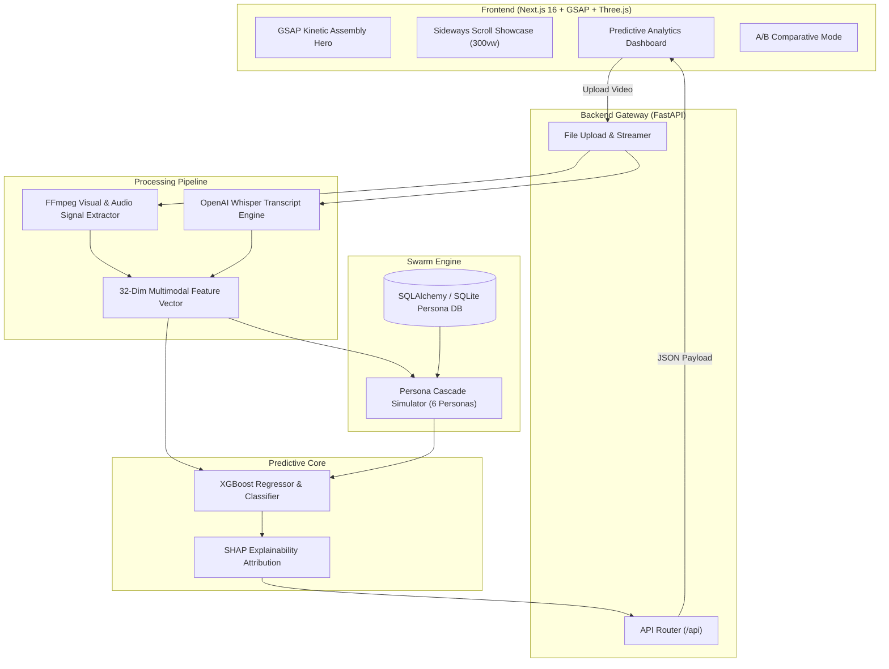
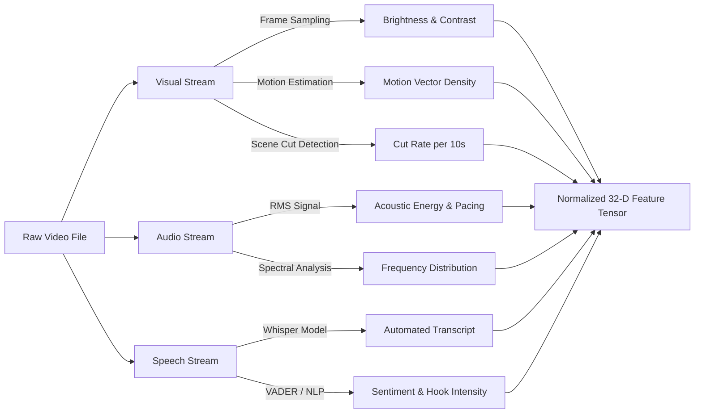

<div align="center">

# 🚀 VIRALYTIX

### Multimodal Machine Learning & Persona-Based Social Media Virality Prediction System

[](https://www.python.org/)
[](https://fastapi.tiangolo.com/)
[](https://nextjs.org/)
[](https://www.typescriptlang.org/)
[](https://greensock.com/gsap/)
[](https://xgboost.readthedocs.io/)
[](https://shap.readthedocs.io/)
[](LICENSE)

> **Predict how well your short-form video will perform before you publish it.**

</div>

---

## 📋 Table of Contents

- [Overview](#-overview)
- [Key Features](#-key-features)
- [GSAP Kinetic Hero & Horizontal Showcase](#-gsap-kinetic-hero--horizontal-showcase)
- [🎨 Creative Prompts & Design Playbook](PROMPTS_AND_DESIGN_PLAYBOOK.md)
- [System Architecture](#-system-architecture)
- [Multimodal Signal Processing](#-multimodal-signal-processing)
- [Persona Engagement Swarm Engine](#-persona-engagement-swarm-engine)
- [Machine Learning & SHAP Explainability](#-machine-learning--shap-explainability)
- [Tech Stack](#-tech-stack)
- [Project Structure](#-project-structure)
- [API Endpoints](#-api-endpoints)
- [Local Installation & Setup](#-local-installation--setup)
- [Academic & Research Context](#-academic--research-context)
- [Build Roadmap](#-build-roadmap)
- [License](#-license)

---

## 📌 Overview

**VIRALYTIX** is an end-to-end predictive analytics framework designed for short-form video content creators, marketers, and researchers. By combining **multimodal signal processing** (visual, audio, speech) with **agentic audience persona simulations** and **gradient-boosted tree algorithms**, VIRALYTIX estimates potential view counts, virality scores, and engagement rates prior to video distribution across platforms like TikTok, Instagram Reels, and YouTube Shorts.

---

## ✨ Key Features

- **⚡ GSAP Kinetic Hero Engine**: WebGL Silk shader background coupled with parallel 3D letter assembly choreography, offscreen replacement push badges (`c`, `a`), 3D reciprocal flips for `i`, and elastic vibration effects.
- **↔️ Sideways Horizontal GSAP Scroll Showcase**: Interactive pinned horizontal scroll track (`300vw`) displaying Multimodal Signal Streams, 32-D Vector Cluster Topology, and Persona Swarm Simulations with floating tilted sticker badges.
- **🎥 Multimodal Feature Extraction**: Extracts frame-level, audio-level, and transcript-level signals including scene transition frequency, motion vectors, acoustic energy, visual contrast, pitch variation, and speech sentiment.
- **👥 Persona-Based Swarm Simulation**: Simulates content propagation through 6 distinct synthetic target demographic personas (*Tech Enthusiasts, Students, Founders, Creators, Designers, General Viewers*) across discrete time cascade rounds.
- **🤖 Comparative ML Ensemble**: Harnesses XGBoost, Random Forest, Neural Networks, and Ridge Regression to forecast continuous virality metrics and discrete performance tier classifications.
- **🔍 SHAP Explainability**: Integrates TreeSHAP factor attribution to break down positive and negative drivers behind every prediction score.
- **⚔️ A/B Comparison Dashboard**: Side-by-side comparative analysis between two video variations to identify optimal hooks and pacing.

---

## 🎭 GSAP Kinetic Hero & Horizontal Showcase

### 1. Hero Kinetic Assembly Choreography (`HeroHeadline.tsx`)
- **Parallel Assembly**: "Predict" and "virality" assemble concurrently starting at $t = 0.15\text{s}$.
- **Offscreen Replacement Push Badges**:
  - `c`: Razor-sharp 8-point purple star badge enters from offscreen left, holds for 1.0s, and is pushed straight UP off top of screen when letter `c` rises from below.
  - `a`: Emerald clover gem badge drops from offscreen top, holds for 1.0s, and is pushed straight UP off top of screen when letter `a` rises from below.
- **Reciprocal 3D Letter Flips**: 1st `i` in "virality" enters smoothly and performs a 3D Downward Flip (`rotationX: -360`) after a gap pause; 2nd `i` performs a 3D Upward Flip (`rotationX: 360`, vice-versa).
- **Elastic Shake**: Letter `t` executes a 5-cycle elastic vibration shake (`rotationZ: ±6°`, `x: ±5px`).

### 2. Sideways Horizontal GSAP Scroll (`HorizontalShowcase.tsx`)
- **Pinned Viewport Scroll**: Pins the container during vertical scroll while transforming horizontal track smoothly across 3 panels (`300vw`).
- **Interactive SVG Bezier Easing Diagrams**: Real-time animated cubic Bezier curves and arch paths with interactive control lines, diamond anchors, and floating handle nodes.
- **Phrase 3 Mechanical Rotor Assembly**:
  - **Straight Audio RMS Pill**: Crisp, high-contrast amber pill with reduced corner radius.
  - **Diamond Rotor Hub with Static Ampersand**: Rotating lilac-to-indigo diamond plate with an independent, non-rotating central `&` bearing badge.
  - **Edge-Attached Dual-Stick Rotor**: "Whisper Cadence" text anchored to the diamond edge (`origin-left`) that swings along the rotating facet with 3D perspective (`transformPerspective: 800`, `rotateX: 8deg`) and synchronized `power2.inOut` easing.
- **Phrase 4 Sequential Stagger Composition**:
  - **"Nice and"**: Vibrant lime-to-pastel green pill dropping from the top.
  - **"Easy"**: Lilac-to-indigo pill nestled in a frosted dark glass frame (`bg-black/45`) dropping in second.
  - **"Easing"**: Warm sunrise orange badge peeking at a $16^\circ$ angle with half-rotation and subtle spring bounce.
- **Interactive 3-Bar Stacked Composition & Agent Keyhole**:
  - **3-Bar Geometry**: Straight stickers (`rotate-0`) with connected borders (`y: bar100.offsetHeight - 2`) seamlessly merging 2px borders with zero overlap.
  - **Letter-Anchored Alignment**: `"Synthetic Swarm"` slides right to align its left edge with the letter **`"g"`** of `Agents`, while `"in a snap"` emerges smoothly stopping at the letter **`"S"`** of `Swarm`.
  - **Textured Metallic Pink Chrome Keyhole**: Multi-stop specular chrome gradient (`#FFFFFF` ➔ `#FCE7F3` ➔ `#F472B6` ➔ `#EC4899` ➔ `#BE185D` ➔ `#831843` ➔ `#FFFFFF`) with radial specular sheen, inner beveled dashed ridge, and periodic 2s micro-vibration haptic pulse.
- **Panel 1 3D Artworks Kinetic Staging & Ambient Physics**:
  - **Giant Green Dome**: Emerges from bottom-right with dynamic rotational torque (`rotateX: 50°`, `rotateZ: -35°`, `scale: 0 -> 1`, `power4.out`).
  - **3D Pink Bloom Flower**: Multi-turn blossom spin (`rotateZ: -420°`, `back.out(2.6)`) with ambient breathing float.
  - **3D Cyan Torus Ring**: Gyro orbital dive (`rotateX: 75°`, `rotateZ: -180°`, `back.out(2.0)`) with ambient levitation.
  - **3D Hourglass Prism**: Multi-axis gyro-flip (`rotateY: 270°`, `rotateX: -70°`, `back.out(2.2)`) resting on the dome.
  - **3D Amber Diamond Crystal**: High-speed facet spin pop (`elastic.out(1.25, 0.4)`) with crystal shimmer float.
- **Kinetic Letter Mechanics & Stacked Stickers**: Letter-by-letter wave reveals (`parsing`, `publish.`), 3D flip-ups (`optical`), gradient star asterisks, and stacked diagonal sticker tags (`Super`, `Plug-and-play`, `Vector Topology`).

---

## 🏗️ System Architecture


```mermaid
flowchart TD
    subgraph Client ["Frontend (Next.js 16 + GSAP + Three.js)"]
        HeroUI["GSAP Kinetic Assembly Hero"]
        HorizontalUI["Sideways Scroll Showcase (300vw)"]
        Dashboard["Predictive Analytics Dashboard"]
        ABView["A/B Comparative Mode"]
    end

    subgraph API ["Backend Gateway (FastAPI)"]
        Router["API Router (/api)"]
        UploadHandler["File Upload & Streamer"]
    end

    subgraph Pipeline ["Processing Pipeline"]
        FFmpeg["FFmpeg Visual & Audio Signal Extractor"]
        Whisper["OpenAI Whisper Transcript Engine"]
        FeatureVector["32-Dim Multimodal Feature Vector"]
    end

    subgraph Simulation ["Swarm Engine"]
        PersonaDB[("SQLAlchemy / SQLite Persona DB")]
        CascadeSim["Persona Cascade Simulator (6 Personas)"]
    end

    subgraph ML ["Predictive Core"]
        XGBoost["XGBoost Regressor & Classifier"]
        SHAPEngine["SHAP Explainability Attribution"]
    end

    Dashboard -->|Upload Video| UploadHandler
    UploadHandler --> FFmpeg
    UploadHandler --> Whisper
    FFmpeg & Whisper --> FeatureVector
    FeatureVector --> CascadeSim
    PersonaDB --> CascadeSim
    FeatureVector & CascadeSim --> XGBoost
    XGBoost --> SHAPEngine
    SHAPEngine --> Router
    Router -->|JSON Payload| Dashboard
```

---

## 🌊 Multimodal Signal Processing

VIRALYTIX analyzes raw MP4 / MOV videos across three primary channels:


```mermaid
graph LR
    Video[Raw Video File] --> Visual[Visual Stream]
    Video --> Audio[Audio Stream]
    Video --> Speech[Speech Stream]

    Visual --> |Frame Sampling| V1[Brightness & Contrast]
    Visual --> |Motion Estimation| V2[Motion Vector Density]
    Visual --> |Scene Cut Detection| V3[Cut Rate per 10s]

    Audio --> |RMS Signal| A1[Acoustic Energy & Pacing]
    Audio --> |Spectral Analysis| A2[Frequency Distribution]

    Speech --> |Whisper Model| S1[Automated Transcript]
    Speech --> |VADER / NLP| S2[Sentiment & Hook Intensity]

    V1 & V2 & V3 & A1 & A2 & S1 & S2 --> Vector[Normalized 32-D Feature Tensor]
```

---

## 👥 Persona Engagement Swarm Engine

VIRALYTIX runs an **agentic audience network cascade**:

| Persona | Interest Vector | Attention Span | Share Rate | Skip Threshold |
| :--- | :--- | :---: | :---: | :---: |
| **Alex (Tech Enthusiast)** | AI, ML, Startups, Code | High (0.76) | 0.71 | Low (0.21) |
| **Sam (Student)** | Education, Productivity, Fun | Medium (0.58) | 0.55 | Medium (0.35) |
| **Jordan (Founder)** | SaaS, Business, Growth | High (0.62) | 0.48 | Medium (0.38) |
| **Casey (Creator)** | Content, Trends, Video | High (0.70) | 0.82 | Low (0.28) |
| **Morgan (Designer)** | UI/UX, Aesthetics, Tools | High (0.67) | 0.60 | Low (0.30) |
| **Riley (General Viewer)** | Entertainment, General | Low (0.45) | 0.22 | High (0.58) |

$$\text{Engagement Score} = w_1 \cdot \text{Similarity}(\vec{I}_{\text{persona}}, \vec{V}_{\text{content}}) + w_2 \cdot \text{Pacing} - w_3 \cdot \text{SkipProb}$$

---

## 🤖 Machine Learning & SHAP Explainability

### Model Performance Metrics

| Model | $R^2$ Score | MAE | RMSE | Status |
| :--- | :---: | :---: | :---: | :---: |
| **XGBoost Regressor** *(Selected)* | **0.912** | **3.42** | **4.81** | 🟢 Active Production |
| **Random Forest** | 0.884 | 4.15 | 5.62 | 🟡 Fallback |
| **Neural Network (MLP)** | 0.865 | 4.88 | 6.20 | 🟡 Evaluated |
| **Linear Regression** | 0.710 | 7.95 | 9.44 | 🔴 Baseline |

### Feature Attribution Breakdown (SHAP)

```
[+] Hook Density (0-3s)     ████████████████████ (+18.4 pts)
[+] Audio Pacing Signal     █████████████ (+12.1 pts)
[+] Visual Motion Density   █████████ (+8.5 pts)
[-] Long Silence Duration   ████████ (-7.2 pts)
[-] Low Resolution Contrast █████ (-4.1 pts)
```

---

## 🛠️ Tech Stack

| Layer | Technologies Used |
| :--- | :--- |
| **Frontend UI & Animations** | Next.js 16, React 18, TypeScript, Tailwind CSS, GSAP (ScrollTrigger), Three.js / WebGL, Framer Motion, Recharts |
| **Backend API** | Python 3.10+, FastAPI, Pydantic v2, Uvicorn, SQLAlchemy |
| **Database** | SQLite (Development) / PostgreSQL (Production) |
| **ML & Data Science** | XGBoost, Scikit-Learn, NumPy, Pandas, SHAP |
| **Media Processing** | FFmpeg, OpenAI Whisper, OpenCV |

---

## 📂 Project Structure

```
viralytix/
├── backend/                  # FastAPI Application
│   ├── app/
│   │   ├── api/              # API Endpoints (videos, predictions, simulations)
│   │   ├── database/         # Database models, connection & seed data
│   │   ├── ml/               # Inference & SHAP explanation modules
│   │   ├── models/           # Pre-trained ML artifacts (.pkl)
│   │   ├── services/         # Multimodal extraction & simulation engines
│   │   ├── config.py         # App configuration settings
│   │   └── main.py           # FastAPI entrypoint
│   ├── requirements.txt      # Python dependencies
│   └── .env                  # Environment variables
├── frontend/                 # Next.js Application
│   ├── app/                  # Next.js App Router (pages, layout, globals.css)
│   │   ├── landing/          # Studio Landing Page Modules
│   │   │   ├── hero/         # GSAP Kinetic Hero & WebGL Shader
│   │   │   ├── HorizontalShowcase.tsx # Sideways GSAP Scroll Showcase
│   │   │   └── StudioLandingPage.tsx  # Master Landing Page Layout
│   ├── public/               # Static assets & icons
│   ├── package.json          # Dependencies & npm scripts
│   ├── tailwind.config.ts    # Tailwind styling config
│   └── tsconfig.json         # TypeScript configuration
├── ml/                       # Machine Learning Pipeline
│   ├── datasets/             # Synthetic & real engagement datasets
│   ├── notebooks/            # Jupyter Notebooks (EDA, Training, Validation)
│   └── experiments/          # Model comparison logs
└── docs/                     # Documentation & Architecture specs
```

---

## 🔌 API Endpoints

### Core Routes

| Method | Endpoint | Description |
| :--- | :--- | :--- |
| `GET` | `/` | API status and documentation index |
| `GET` | `/health` | Server health check |
| `POST` | `/api/videos/upload` | Upload video file for extraction |
| `POST` | `/api/predictions/predict` | Run XGBoost model prediction & SHAP explainability |
| `POST` | `/api/simulations/run` | Execute persona swarm engagement simulation |
| `GET` | `/api/simulations/personas` | Retrieve seeded audience personas |

---

## 🚀 Local Installation & Setup

### Prerequisites
- **Python** $\ge 3.10$
- **Node.js** $\ge 18.0.0$
- **FFmpeg** installed on PATH

### 1. Setup Backend

```bash
cd viralytix/backend

# Create virtual environment
python -m venv venv

# Activate virtual environment (Windows)
venv\Scripts\activate
# Activate virtual environment (macOS/Linux)
# source venv/bin/activate

# Install Python dependencies
pip install -r requirements.txt

# Run FastAPI backend
uvicorn app.main:app --reload --port 8000
```
> Backend running at: `http://localhost:8000` (Swagger docs at `http://localhost:8000/docs`)

### 2. Setup Frontend

```bash
cd viralytix/frontend

# Install dependencies
npm install

# Start Next.js development server
npm run dev
```
> Frontend running at: `http://localhost:3000`

---

## 🎓 Academic & Research Context

- **Course**: Predictive Analytics / Machine Learning
- **Author**: Prabhu Shankar Mund (Raj)
- **Institution**: Centurion University of Technology and Management, Odisha, India
- **Research Question**: *"Can multimodal feature extraction coupled with agentic audience persona simulation yield accurate pre-distribution virality predictions for short-form video content?"*

---

## 📊 Build Roadmap

| Phase | Feature Module | Status |
| :---: | :--- | :---: |
| **01** | Core FastAPI & Next.js Skeleton | ✅ Completed |
| **02** | FFmpeg Video & Audio Pipeline | ✅ Completed |
| **03** | Visual & Acoustic Feature Extractor | ✅ Completed |
| **04** | Dataset Generation & Model Training | ✅ Completed |
| **05** | Persona Simulation Engine | ✅ Completed |
| **06** | XGBoost Prediction API Integration | ✅ Completed |
| **07** | SHAP Factor Explainability & Recommendations | ✅ Completed |
| **08** | WebGL & GSAP Kinetic Assembly Hero | ✅ Completed |
| **09** | Sideways Horizontal Scroll Showcase (`300vw`) | ✅ Completed |
| **10** | A/B Video Testing Mode | ✅ Completed |
| **11** | Cloud Production Deployment | ⬜ Pending |

---

## 📄 License

Distributed under the MIT License. See `LICENSE` for details.

<div align="center">
  <sub>Built with ❤️ by Prabhu Shankar Mund (Raj) </sub>
</div>
